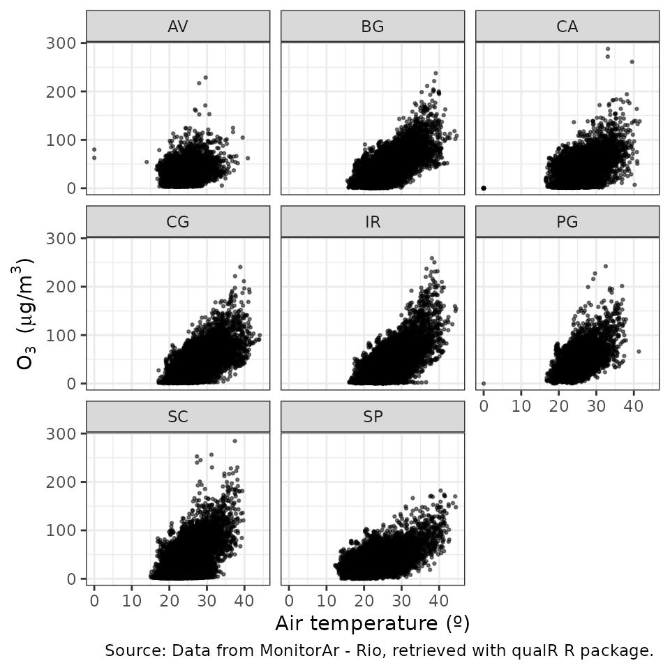

# How to use qualR

## Context

Both the State of São Paulo and Rio de Janeiro have one of the most
extensive air quality stations network in South America. [CETESB QUALAR
System](https://cetesb.sp.gov.br/ar/qualar/) provide to the user the air
quality data from the State of São Paulo. QUALAR System limits the
download to one parameter from one air station for one year in a simple
query (three parameter in advance query). The data can have missing
hours (e.g. due to calibration), the decimal separator is “,”, and the
output is a CSV file.
[data.rio](https://www.data.rio/maps/PCRJ::qualidade-do-ar-dados-hor%C3%A1rios/about)
hosts the air quality information from Monitor Ar Program. It is not an
user-friendly API and the data needs the same preprocessor as the data
from QUALAR System.

`qualR` surpasses these limitations and brings to your R session
ready-to use data frames with the information of air quality station
from the State of São Paulo and the city of Rio de Janeiro.

## Approach

`qualR` has the following functions:

- `cetesb_retrieve_param`: Download a list of different parameter from
  one air quality station (AQS) from CETESB QUALAR System.
- `cetesb_retrieve_pol`: Download criteria pollutants from one AQS from
  CETESB QUALAR System.
- `cetesb_retrieve_met`: Download meteorological parameters from one AQS
  from CETESB QUALAR System.
- `cetesb_retrieve_met_pol`: Download meteorological parameters and
  criteria pollutants from one AQS from CETESB QUALAR System.
- `monitor_ar_retrieve_param`: Download a list of different parameters
  from MonitorAr - Rio program.
- `monitor_ar_retrieve_pol`: Download criteria pollutants from one AQS
  from MonitorAr - Rio program.
- `monitor_ar_retrieve_met`: Download meteorological parameters from one
  AQS from MonitorAr - Rio program.
- `monitor_ar_retrieve_met_pol`: Download meteorological parameters and
  criteria pollutants from one AQS from MonitorAr - Rio Program.

## Example to download data from Rio de Janeiro

In this example we want to download one year PM10 concentration from an
air quality station located in Rio de Janeiro downtown. We need to do
the following:

1.  Check for the code or abbreviation of the station.

``` r

library(qualR)
monitor_ar_aqs
#>                         name code       lon       lat x_utm_sirgas2000
#> 1 ESTACAO PEDRA DE GUARATIBA   PG -43.62901 -23.00438         640506.0
#> 2              ESTACAO BANGU   BG -43.47107 -22.88791         656828.8
#> 3       ESTACAO CAMPO GRANDE   CG -43.55652 -22.88625         648064.5
#> 4              ESTACAO IRAJA   IR -43.32684 -22.83162         671696.6
#> 5         ESTACAO COPACABANA   AV -43.18048 -22.96500         686537.0
#> 6             ESTACAO TIJUCA   SP -43.23266 -22.92492         681240.2
#> 7      ESTACAO SAO CRISTOVAO   SC -43.22175 -22.89777         682395.8
#> 8             ESTACAO CENTRO   CA -43.17815 -22.90834         686853.7
#>   y_utm_sirgas2000
#> 1          7455338
#> 2          7468075
#> 3          7468346
#> 4          7474147
#> 5          7459198
#> 6          7463703
#> 7          7466695
#> 8          7465470
```

2.  Check for the code or abbreviation of the parameters.

``` r

monitor_ar_param
#>         code                                name units
#> 1        SO2                  Dioxido de enxofre ug/m3
#> 2        NO2               Dioxido de nitrogenio ug/m3
#> 3         NO              Monoxido de Nitrogenio ug/m3
#> 4        NOx                Oxidos de nitrogenio ug/m3
#> 5       HCNM Hidrocarbonetos Totais menos Metano   ppm
#> 6        HCT              Hidrocarbonetos Totais   ppm
#> 7        CH4                              Metano ug/m3
#> 8         CO                 Monoxido de Carbono   ppm
#> 9         O3                              Ozonio ug/m3
#> 10      PM10                Particulas Inalaveis ug/m3
#> 11     PM2_5          Particulas Inalaveis Finas ug/m3
#> 12     Chuva          Precipitacao Pluviometrica    mm
#> 13      Pres                 Pressao Atmosferica  mbar
#> 14        RS                      Radiacao Solar  W/m2
#> 15      Temp                         Temperatura    ºC
#> 16        UR              Umidade Relativa do Ar     %
#> 17 Dir_Vento                    Direcao do Vento     º
#> 18 Vel_Vento                 Velocidade do Vento   m/s
```

3.  We have that the air quality station `code` is `CA` (Estação
    Centro), and PM10 `code` is `PM10`. So we use the function
    [`monitor_ar_retrieve_param()`](https://docs.ropensci.org/qualR/reference/monitor_ar_retrieve_param.md).

``` r

rj_centro <- monitor_ar_retrieve_param(start_date = "01/01/2019",
                                       end_date = "31/12/2019",
                                       aqs_code = "CA",
                                       parameters = "PM10")
#> Your query is:
#> Parameter: PM10
#> Air quality station: ESTACAO CENTRO
#> Period: From 01/01/2019 to 31/12/2019
#> Succesful request
#> Downloading  PM10

head(rj_centro)
#>                  date pm10 aqs
#> 1 2018-12-31 22:30:00   51  CA
#> 2 2018-12-31 23:30:00   73  CA
#> 3 2019-01-01 00:30:00  119  CA
#> 4 2019-01-01 01:30:00   92  CA
#> 5 2019-01-01 02:30:00   57  CA
#> 6 2019-01-01 03:30:00   43  CA
```

4.  We can download multiple parameters too. For example, maybe we need
    to know the relationship between PM10 and Wind Speed. To do that we
    just need to define a vector with the parameters we need.

``` r

to_dwld <- c("PM10", "Vel_Vento")

rj_ca_params <- monitor_ar_retrieve_param(start_date = "01/01/2019",
                                    end_date = "31/12/2019",
                                    aqs_code = "CA",
                                    parameters = to_dwld)
#> Your query is:
#> Parameter: PM10, Vel_Vento
#> Air quality station: ESTACAO CENTRO
#> Period: From 01/01/2019 to 31/12/2019
#> Succesful request
#> Downloading  PM10 Vel_Vento
head(rj_ca_params)
#>                  date pm10   ws aqs
#> 1 2018-12-31 22:30:00   51 0.85  CA
#> 2 2018-12-31 23:30:00   73 0.45  CA
#> 3 2019-01-01 00:30:00  119 0.53  CA
#> 4 2019-01-01 01:30:00   92 0.45  CA
#> 5 2019-01-01 02:30:00   57 0.25  CA
#> 6 2019-01-01 03:30:00   43 0.53  CA
```

5.  Now we can make a simple plot

``` r

plot(rj_ca_params$ws, rj_ca_params$pm10,
     xlab = "Wind speed (m/s)",
     ylab = "",
     xlim = c(0,4),
     ylim = c(0,120))
mtext(expression(PM[10]~" ("*mu*"g/m"^3*")"), side = 2, line = 2.5)
```


## An example using `tidyverse`

`tidyverse` is a powerful collection of R package. Here is an example
using `purrr`to download data from multiple stations and `ggplot2`to
visualize the relation between Ozone and air temperature. As we know
Ozone is formed by photochemical reaction which means the participation
of solar radiation.

``` r

library(qualR)
library(purrr)

# Retrieve data from all stations in Rio
rj_params <- purrr::map_dfr(.x = qualR::monitor_ar_aqs$code, 
                            .f = monitor_ar_retrieve_param,
                            start_date = "01/01/2020",
                            end_date = "31/12/2020",
                            parameters = c("O3", "Temp")
)
#> Your query is:
#> Parameter: O3, Temp
#> Air quality station: ESTACAO PEDRA DE GUARATIBA
#> Period: From 01/01/2020 to 31/12/2020
#> Succesful request
#> Downloading  O3 Temp
#> Your query is:
#> Parameter: O3, Temp
#> Air quality station: ESTACAO BANGU
#> Period: From 01/01/2020 to 31/12/2020
#> Succesful request
#> Downloading  O3 Temp
#> Your query is:
#> Parameter: O3, Temp
#> Air quality station: ESTACAO CAMPO GRANDE
#> Period: From 01/01/2020 to 31/12/2020
#> Succesful request
#> Downloading  O3 Temp
#> Your query is:
#> Parameter: O3, Temp
#> Air quality station: ESTACAO IRAJA
#> Period: From 01/01/2020 to 31/12/2020
#> Succesful request
#> Downloading  O3 Temp
#> Your query is:
#> Parameter: O3, Temp
#> Air quality station: ESTACAO COPACABANA
#> Period: From 01/01/2020 to 31/12/2020
#> Succesful request
#> Downloading  O3 Temp
#> Your query is:
#> Parameter: O3, Temp
#> Air quality station: ESTACAO TIJUCA
#> Period: From 01/01/2020 to 31/12/2020
#> Succesful request
#> Downloading  O3 Temp
#> Your query is:
#> Parameter: O3, Temp
#> Air quality station: ESTACAO SAO CRISTOVAO
#> Period: From 01/01/2020 to 31/12/2020
#> Succesful request
#> Downloading  O3 Temp
#> Your query is:
#> Parameter: O3, Temp
#> Air quality station: ESTACAO CENTRO
#> Period: From 01/01/2020 to 31/12/2020
#> Succesful request
#> Downloading  O3 Temp
```

Now we can visualize all the data simultaneity using `ggplot2` facet:

``` r

library(magrittr)
#> 
#> Attaching package: 'magrittr'
#> The following object is masked from 'package:purrr':
#> 
#>     set_names
library(ggplot2)

# making the graph with facet
rj_params %>% 
  ggplot() +
  geom_point(aes(x = tc, y = o3), size = 0.5,  alpha = 0.5) +
  labs(x = "Air temperature (º)",
       y = expression(O[3]~" ("*mu*"g/m"^3*")"),
       caption = "Source: Data from MonitorAr - Rio, retrieved with qualR R package. "
       )+
  theme_bw()+
  facet_wrap(~aqs)
#> Warning: Removed 12455 rows containing missing values or values outside the scale range
#> (`geom_point()`).
```



PS: Special thanks to [@beatrizmilz](https://github.com/beatrizmilz) for
inspiring this example.

## Compatibility with `openair`

`qualR` functions returns a completed data frame (i.e. missing hours
padded out with `NA`) with a `date` column in `POSIXct`. This ensure
compatibility with the `openair`package.

Here is the code to use openair
[`timeVariation()`](https://openair-project.github.io/openair/reference/timeVariation.html)
function. Note that no preprocessing is needed.

``` r

#install.package("openair")
library(openair)
openair::timeVariation(rj_centro, pollutant = "pm10")
```

## Example to download data from São Paulo State stations

To use `cetesb_retrieve` you first need to create an account in [CETESB
QUALAR
System](https://seguranca.cetesb.sp.gov.br/Home/CadastrarUsuario). The
`cetesb_retrieve` functions are similar as `monitor_ar_retrieve_param`
functions, but they require the `username` and `password` arguments.
[Check this
section](https://github.com/quishqa/qualR#a-better-way-to-save-your-credentials)
on `qualR` README to safely configure your user name and password on
your R session.

In this example, we download Ozone concentration from an air quality
station located at Universidade de São Paulo (USP-Ipen) for August,
2021. 1. Check the station `code` or `name`

``` r

head(cetesb_aqs, 15)
#>                          name code       lat       lon       loc
#> 1                   Americana  290 -22.72425 -47.33955  Interior
#> 2    Americana-Vila Sta Maria  105 -22.72425 -41.33955  Interior
#> 3                   Araçatuba  107 -21.18684 -50.43932  Interior
#> 4                  Araraquara  106 -21.78252 -48.18583  Interior
#> 5                       Bauru  108 -22.32661 -49.09276  Interior
#> 6                     Cambuci   90 -23.56771 -46.61227      <NA>
#> 7             Campinas-Centro   89 -22.90252 -47.05721  Interior
#> 8           Campinas-Taquaral  276 -22.87462 -47.05897  Interior
#> 9            Campinas-V.União  275 -22.94673 -47.11928  Interior
#> 10              Capão Redondo  269 -23.66836 -46.78004 São Paulo
#> 11                Carapicuíba  263 -23.53140 -46.83578      MASP
#> 12                  Catanduva  248 -21.14194 -48.98308  Interior
#> 13                     Centro   94 -23.54781 -46.64241      <NA>
#> 14            Cerqueira César   91 -23.55354 -46.67270 São Paulo
#> 15 Cid.Universitária-USP-Ipen   95 -23.56634 -46.73741 São Paulo
```

2.  Check ozone `code` or abbreviation

``` r

head(cetesb_param, 15)
#>                                          name units code
#> 1                               BEN (Benzeno) ug/m3   61
#> 2                    CO (Monoxido de Carbono)   ppm   16
#> 3                       DV (Direcao do Vento)     º   23
#> 4               DVG (Direcao do Vento Global)     º   21
#> 5                ERT (Enxofre Reduzido Total)   ppb   19
#> 6  HCNM (Hidrocarbonetos Totais menos Metano)     -   59
#> 7                 MP10 (Particulas Inalaveis) ug/m3   12
#> 8          MP2.5 (Particulas Inalaveis Finas) ug/m3   57
#> 9                 NO (Monoxido de Nitrogenio) ug/m3   17
#> 10                NO2 (Dioxido de Nitrogenio) ug/m3   15
#> 11                 NOx (Oxidos de Nitrogenio)   ppb   18
#> 12                                O3 (Ozonio) ug/m3   63
#> 13                PRESS (Pressao Atmosferica)   hPa   29
#> 14               RADG (Radiacao Solar Global)  W/m2   26
#> 15             RADUV (Radiacao Ultra-violeta)  W/m2   56
```

3.  The air quality station is `95` and ozone code is `63`. So to
    retrieve the data we should use the `cetesb_retrieve_param`function
    like this:

``` r

usp_o3 <- cetesb_retrieve_param(username = my_user,
                                password = my_password,
                                parameters = "O3", # or 63
                                aqs_code = "Cid.Universitaria-USP-Ipen",  # or 95
                                start_date = "01/08/2021",
                                end_date = "31/08/2021")      
```

## More information

- You can check [`qualR`
  README](https://github.com/quishqa/qualR#readme) for more examples and
  good practices.
- You can also check [this
  tutorial](https://github.com/quishqa/qualR_tuto) for more examples of
  `qualR` and how it works with `openair`.
